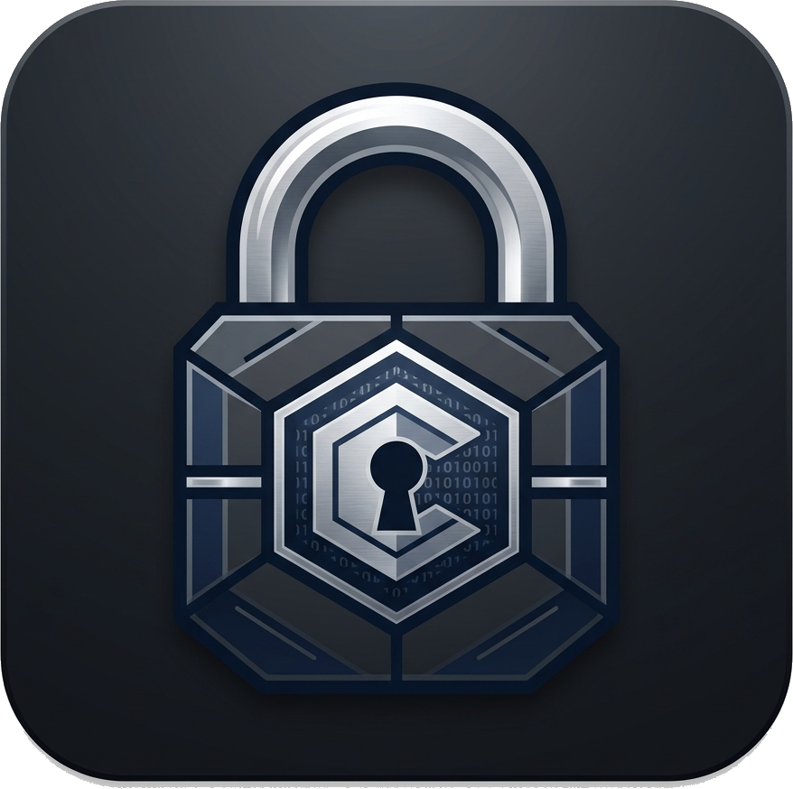

<p align="center">
  
</p>

# EncryptA3 (Cofre ICP-Brasil) 🔒

O **EncryptA3** é uma ferramenta de altíssima segurança projetada para garantir o sigilo absoluto de documentos e pastas sensíveis utilizando **Criptografia Híbrida Avançada**. Ele atua como um aplicativo com Interface Gráfica moderna (GTK3), utilitário de terminal (TUI) e **Extensão Nativa do Gerenciador de Arquivos (Caja)**.

Ao invés de depender de senhas fracas que podem ser adivinhadas, o EncryptA3 utiliza o hardware criptográfico do seu **Token A3 (Padrão ICP-Brasil OAB/e-CPF)** para trancar e destrancar uma dupla camada de chaves de grau militar (AES-GCM + XSalsa20).

## 🚀 Como Funciona a Criptografia Híbrida?
1. **Trancar (Criptografar):** O sistema gera chaves simétricas descartáveis super-rápidas e cifra seu documento ou pasta em milissegundos. Em seguida, a **Chave Pública** (RSA) do seu Token A3 é usada para encapsular essas chaves dentro de um cofre matemático. O resultado é um arquivo blindado e selado (extensão padrão `.ea3`).
2. **Destrancar (Decifrar):** Para abrir o cofre, você insere seu Token A3 na porta USB e digita seu PIN. A sua **Chave Privada** (que é fisicamente impossível de ser extraída do chip do pendrive) destranca o cofre interno, recuperando os documentos originais perfeitamente intactos.

Mesmo se o seu computador for roubado, invadido ou confiscado, os arquivos estarão matematicamente inacessíveis sem a presença física do seu Token A3 ICP-Brasil e do PIN. Zero chance de ataque de dicionário.

## ✨ Funcionalidades
- **Interface Gráfica Completa (GUI):** Interface GTK3 que se integra nativamente ao visual do sistema Linux (MATE/GNOME). Suporte a arrastar-e-soltar de arquivos.
- **Modo Furtivo (Stealth Mode):** Disfarce seus arquivos criptografados removendo a extensão `.ea3` e aplicando extensões falsas comuns (ex: `.mp4`, `.pdf`). Sem metadados óbvios e completamente indistinguíveis de ruído branco, negando a existência da criptografia para xeretas.
- **Autenticação Dupla Cooperativa:** Quer se precaver contra a queima ou perda física do Token? Na hora de cifrar, você pode empacotar as chaves usando o Token A3 **E** uma Senha de Recuperação super forte simultaneamente (com hash protegido via Argon2). Na hora de decifrar, você escolhe qual das duas chaves quer usar.
- **Criptografia de Alta Performance em Streaming:** Suporte para arquivos e pastas gigantes (Gigabytes ou Terabytes) com baixíssimo consumo de memória RAM, fatiando os dados. O cabeçalho usa algoritmos de correção de erro (Reed-Solomon) para resistir a corrupções de bit.
- **Wipe Opcional de Arquivos Originais:** Destrua o arquivo não-criptografado da face da Terra (*secure wipe*) assim que o cofre for lacrado. *(Aviso: SSDs modernos com wear-leveling podem mitigar técnicas de wiping lógico).*
- **Compatibilidade Inteligente de Hardware:** Auto-detecta falhas de implementação no driver do fabricante do Smartcard (como a falta de suporte a `RSA_PKCS_OAEP`) e cai graciosamente para o padrão universal suportado `RSA_PKCS_1.5` de forma segura. Detecta os drivers PKCS#11 (SafeSign, OpenSC, eTPkcs11) automaticamente.

## 🛠️ Requisitos
- Linux (testado em Debian Trixie/MATE e Ubuntu/GNOME)
- Python 3.10+
- Bibliotecas do Sistema para PKCS11 (SafeSign / OpenSC) e GTK.
- Token A3 (OAB, e-CPF, e-CNPJ) plugado na USB.

## 💻 Instalação

```bash
# Entre na pasta do projeto
cd ~/Documentos/encrypta3

# Instale as dependências globalmente (em ambientes externos Debian, use pip --break-system-packages se não usar venv)
pip install cryptography pynacl argon2-cffi reedsolo python-pkcs11 PyGObject
```

### Habilitando a Extensão no Gerenciador de Arquivos (Caja)
Para ter um menu de clique-direito do mouse para trancar/destrancar pelo navegador de arquivos:
```bash
mkdir -p ~/.local/share/caja-python/extensions/
cp caja_action.py ~/.local/share/caja-python/extensions/
caja -q  # Reinicia o Caja para aplicar as mudanças
```

## ▶️ Como Usar

### Via Interface Gráfica (Aplicativo Standalone)
Rode a interface principal para ter acesso ao arrastar-e-soltar e ao **Modo Furtivo**:
```bash
PYTHONPATH=/home/diego/Documentos/encrypta3 python3 -m encrypta3.gui.app
```

### Via Menu de Contexto (Caja)
1. Navegue até o arquivo ou pasta que deseja proteger.
2. Clique com o **botão direito** do mouse sobre o arquivo.
3. No menu principal, clique na opção relacionada ao Cofre A3.
4. Uma caixa segura nativa do sistema aparecerá. Digite o seu PIN e aguarde a mágica!

### Via Terminal (TUI)
Pela linha de comando, basta executar:
```bash
PYTHONPATH=/home/diego/Documentos/encrypta3 python3 -m encrypta3.tui
```
A interface de texto guiará você pelo resto do processo usando menus no teclado.

---
*Desenvolvido por Diego Ribeiro de Souza.*
